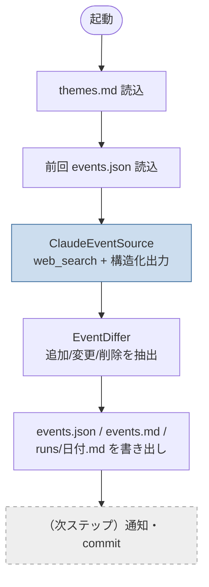
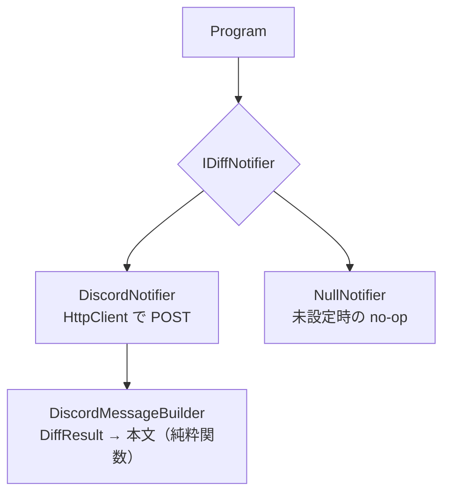

# イベント収集プロトタイプ 設計書

`summary/260621/04-event-collector.md` の精査を受けた、プロトタイプの設計。
本ステップでは **コア（収集 → events.md 生成 → 差分記録）** を C# で実装する。通知・GitHub Actions 連携は次ステップ。

## スコープ

| 実装済み | 含まない（次ステップ） |
|----------|------------------------|
| テーマ設定の読み込み | Gmail 通知 |
| Claude + web_search による収集 | GitHub Actions(cron) ワークフロー |
| 構造化出力（JSON）への整形 | テーマの自律拡張ロジック本体 |
| events.md / events.json 生成 | 自動コミット |
| 前回との差分抽出・runs ログ | web_search の pause_turn 継続ループ |
| **差分発生時の Discord Webhook 通知** | |

## データ構造

リポジトリ直下を起点とする（`event` リポジトリのルート）。

```
event/                        … リポジトリルート
├── DESIGN.md                 … 本書
├── config/
│   ├── themes.md             … 収集テーマ（人間 + Claude が編集）
│   └── participated.md       … 参加イベントログ（テーマ拡張の根拠）
├── data/
│   └── events.json           … 機械可読スナップショット（差分の真実の源）
├── events.md                 … 人間向けの最新一覧（毎回再生成）
├── runs/
│   └── <yyyy-MM-dd>.md        … 実行ごとの差分記録
└── src/EventCollector/        … 収集スクリプト（C#）
```

### なぜ events.json と events.md を分けるか

- **events.json** … 差分検知の基準。前回値と機械的に比較する。md をパースし直すより堅牢。
- **events.md** … 人間が読む用。GitHub 上でそのまま閲覧できる。

## 処理フロー



## コンポーネント（C#）

### 通知（Discord）

差分発生時に Discord Webhook へ通知する。責務を分離し、本文整形は HTTP から切り離して単体テスト可能にしている。



- Webhook URL は環境変数 `DISCORD_WEBHOOK_URL`。未設定なら `NullNotifier` でスキップ（収集は完了する）。
- `DiscordMessageBuilder` は `DiscordMessageBuilderTests` で単体テスト済み（件数・各イベント名・2000字上限）。

### クラス一覧

| クラス | 役割 |
|--------|------|
| `Program` | 全体のオーケストレーション（各サービスを順に呼ぶ） |
| `ThemeStore` | `themes.md` からテーマ一覧を読む |
| `ClaudeEventSource` | Claude API（`web_search` + 構造化出力）でイベントを収集 |
| `SnapshotReconciler` | 前回分と今回分を和集合マージし、過去日のみ除外した新スナップショットを作る（収集のゆらぎで未来イベントが消えるのを防ぐ） |
| `EventDiffer` | 前回スナップショットと比較し追加/変更/削除を抽出 |
| `MarkdownRenderer` | `events.md` と `runs/日付.md` を生成 |
| `Models/Events.cs` | `EventItem` / `CollectionResult` / `DiffResult` |

## 技術選定メモ

- **モデル：Claude Haiku 4.5**（`claude-haiku-4-5`）— コスト優先（#7）
  - basic web search（`web_search_20250305`）と構造化出力の両方に対応し、最も安価。
  - 動的フィルタリング版 `web_search_20260209` は内部で code execution を回し重く高コストなため不採用。検索回数は `MaxUses=3` に制限。
- **収集は2フェーズ**（#5 で単一呼び出しのタイムアウトを解消）:
  - Phase1: `web_search`（`MaxUses` で回数制限）+ **ストリーミング**で所見テキストを取得。長時間要求のタイムアウト・キャンセルを回避する。
  - Phase2: ツール無し + **構造化出力（`output_config.format`）** で所見を JSON に整形。`web_search × 構造化出力` の相性問題を回避し、各呼び出しを確実に終わらせる。
- **APIキー**：`ANTHROPIC_API_KEY` 環境変数から読む（コードに埋め込まない）。

## 既知の TODO（未完の箇所）

1. **pause_turn の継続ループ**：`web_search` が10反復上限で `pause_turn` を返す稀なケースの継続処理。現状は `MaxUses` 制限とストリーミングで実用上は回避済み。
2. **テーマ自律拡張**：`participated.md` を参照して Claude にテーマを提案・追記させるロジックは次ステップ。
3. **Gmail 通知**：次ステップ。

## 次ステップの候補

1. 実機で1回動かしてトークン消費・出力品質を計測（精査で示した「1回数円〜数十円」を検証）。
2. ~~Discord Webhook 通知を追加。~~（実装済み: #1）
3. GitHub Actions（cron）で定期実行し、差分があれば自動コミット。
