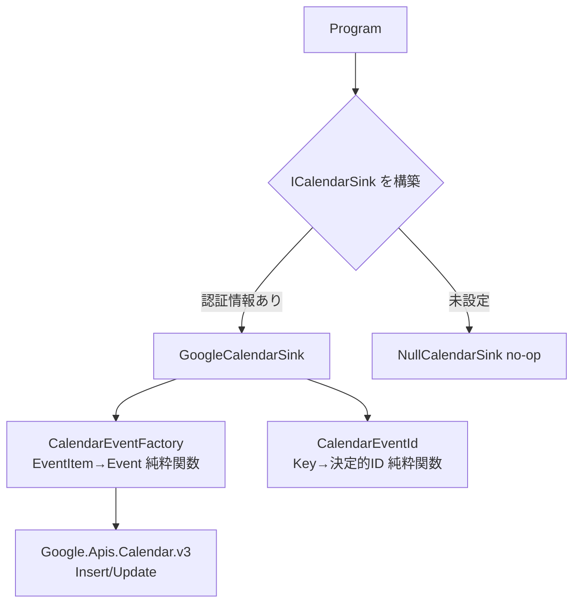

# 調査: 収集イベントの Google カレンダー登録

収集した未来イベント（merged snapshot）を Google カレンダーへ予定として登録するための調査。
GitHub Actions（無人実行）から書き込む前提で、認証方式・冪等性・日付の扱いを整理する。

## 採用方針（ユーザー決定）

- **認証**: ~~サービスアカウント JSON 鍵~~ → **Workload Identity Federation（鍵レス）** に変更。
  組織ポリシー `iam.disableServiceAccountKeyCreation` で鍵発行が禁止のため。長期鍵を持たず
  GitHub OIDC を GCP が信頼して短期credentialsに交換する（#29）。コードは鍵 JSON / ADC の両対応。
- **登録先**: 専用の新規カレンダー

## なぜサービスアカウントか

| 方式 | CI 適性 | 備考 |
|------|---------|------|
| **サービスアカウント** | ◎ | 無人で動く。トークン失効なし。鍵 JSON を Secret に置く。個人カレンダーをサービスアカウントのメールに「共有（編集権限）」すれば書ける |
| OAuth リフレッシュトークン | △ | 一度ローカルで認証してトークンを Secret 化。失効・再認証のリスクがあり cron 向きでない |

> サービスアカウントは「ロボット用の Google アカウント」。対話ログインせず鍵で認証するので、
> GitHub Actions のような無人環境に向く。個人カレンダーへ書くには、そのカレンダーを
> サービスアカウントのメールアドレスに共有して編集権限を与える（Workspace のドメイン委任は不要）。

## ライブラリ

- **Google.Apis.Calendar.v3**（公式 .NET クライアント）
- 認証は `ServiceAccountCredential` を JSON から構築し、スコープ `CalendarService.Scope.Calendar` を付与。

## 冪等性（二重登録の防止）

毎回 merged 全件を upsert する。イベントのキーから**決定的な Calendar イベント ID** を作る。

- Google Calendar の event id 制約: 文字は base32hex（`0-9a-v`）、長さ 5〜1024、小文字。
- 実装: `SHA-256(Key)` → 先頭バイト列を base32hex で小文字エンコード → 既定 ID とする。
- 流れ: まず `Events.Insert(id)`。既に存在して 409 が返れば `Events.Update(id)`。
  - これで「無ければ作成・あれば更新」を ID ベースで実現でき、毎回流しても重複しない。

## 日付の扱い

- `Date` はモデルの自由記述（例 `2026-06-25～26` / `2026-09-19` / `TBD`）。
- 既存 `EventDate.TryGetStartDate` で先頭 `yyyy-MM-dd` を開始日に採用し、**終日予定**として登録。
  - 終日予定は `start.date` / `end.date`（時刻なし）。Google 仕様で end.date は翌日（排他的）にする。
- 解析できない（`TBD` 等）イベントは**スキップ**（カレンダーに置けないため）。
- merged は過去日を除外済みなので、登録対象は未来イベントのみ。

## 設定（環境変数 / Secret）

| 変数 | 用途 |
|------|------|
| `GOOGLE_CALENDAR_CREDENTIALS` | サービスアカウント JSON（鍵の中身） |
| `GOOGLE_CALENDAR_ID` | 登録先カレンダーの ID（専用カレンダーの「カレンダー ID」） |

- 両方そろっていれば登録、未設定なら **NullCalendarSink** でスキップ（Discord の Null 実装と同じ思想で、未設定でも収集は完了する）。

## 設計（クラス）

- `CalendarEventFactory` と `CalendarEventId` は純粋関数として単体テストする（HTTP 不要）。
- `GoogleCalendarSink` の HTTP 部分はテスト対象外（薄く保つ）。

## 実装ステップ（2段階）

1. **コード一式 + テスト**（本体）。Secret 未設定なら NullCalendarSink でスキップ＝既存 CI は不変。
2. **GCP セットアップ + Secret 登録 + ワークフロー有効化 + 実機検証**（別 Issue）。

## 参考

- Google Calendar API (events: insert/update) — event id は base32hex 制約あり。
- ServiceAccountCredential（Google.Apis.Auth）でサービスアカウント JSON から認証。
