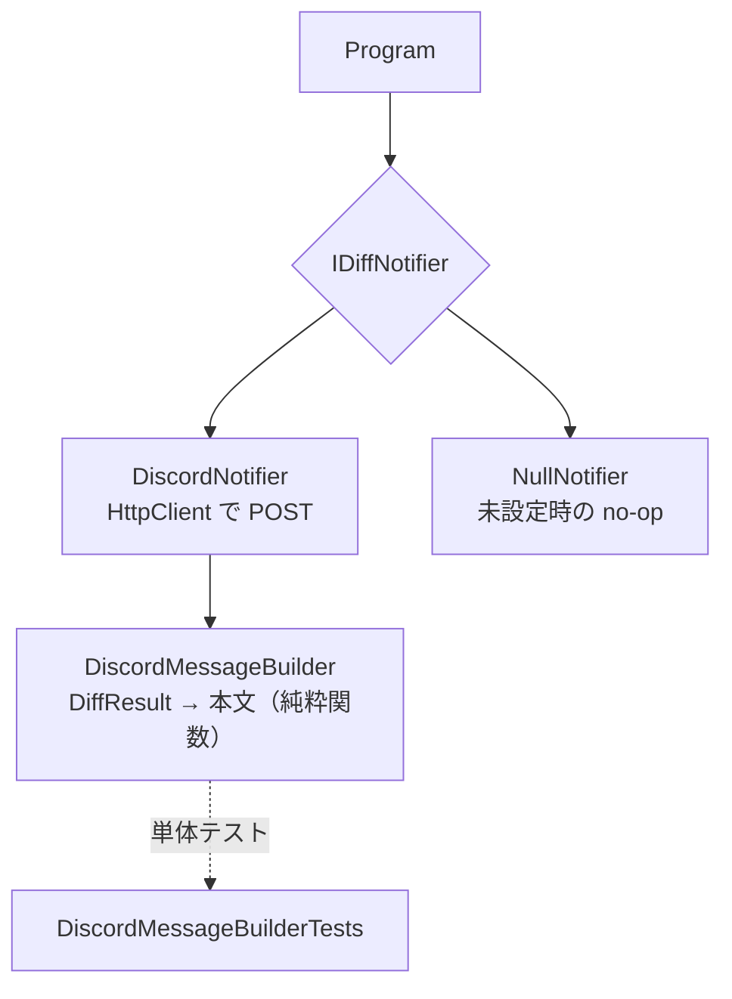

# 実装概要: Discord Webhook 通知（#1）

差分発生時に Discord へ通知する機能を実装した。

## やったこと

- 収集結果に前回からの差分（追加 / 変更 / 削除）がある場合、Discord Webhook へ通知する。
- Webhook URL は環境変数 `DISCORD_WEBHOOK_URL` から取得。未設定なら通知をスキップ（収集は完了）。

## 構成（責務分離）

| 追加クラス | 役割 |
|------------|------|
| `IDiffNotifier` | 通知の抽象（依存性逆転） |
| `DiscordMessageBuilder` | 差分→本文の純粋関数。単体テスト対象 |
| `DiscordNotifier` | Webhook へ POST |
| `NullNotifier` | 未設定時の Null Object |

## TDD / レビュー観点

- `DiscordMessageBuilderTests` を先に書いてから実装（件数・各イベント名・2000字上限を検証、2件合格）。
- セキュリティ: Webhook URL は環境変数管理。コードに秘匿情報を埋め込まない。
- SOLID: 抽象への依存（DIP）、本文整形と送信の単一責務分離（SRP）、Null Object で分岐を排除。
- 通知失敗は収集自体を失敗させない（収集の堅牢性を維持）。

## 残課題

Gmail 通知 / GitHub Actions（cron）/ 自動コミット / pause_turn 継続ループ（`DESIGN.md` の TODO 参照）。
